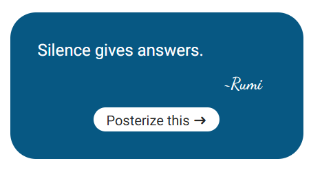

# A Poster Generator

With this app you can make a poster on screen with a chosen quote and a random photo, all based on the same search term.


## How to use it

1. Just enter a search term on the home page.
2. After pressing enter you will be taken to any quotes containing that phrase or authors name.
3. If quotes are found, choose one and click on "Posterize this". You will be taken to the poster-page where a random photo on the same theme is used as background to the quote. 
4. Dont like the combo? get a new image with the "Get another photo"-button or by refreshing the page.
5. Like it a lot? Save it as a favourite. The saved posters are available under "Saved Posters" in the menu.



APIs used:  
Quotes: [`dummyjson.com/docs/quotes`](https://dummyjson.com/docs/quotes)  
Photos: [`pixabay.com/api/docs/`](https://pixabay.com/api/docs/)  


## In order for it to work you will need to:

1. Get your own API-key from [`Pixabay`](https://pixabay.com/) by signing up there. More info about the API at their [`API docs page`](https://pixabay.com/api/docs/).
2. Then place it in an env.local-file in the root folder. 
3. Name it IMAGE_API_KEY, like this: IMAGE_API_KEY=xxxxxxxxxx


-----------------------------------------------------------------------------------------------------------------------------------------------------
-----------------------------------------------------------------------------------------------------------------------------------------------------


This is a [Next.js](https://nextjs.org) project bootstrapped with [`create-next-app`](https://nextjs.org/docs/app/api-reference/cli/create-next-app).

## Getting Started

First, run the development server:

```bash
npm run dev

```

Open [http://localhost:3000](http://localhost:3000) with your browser to see the result.


## Learn More

To learn more about Next.js, take a look at the following resources:

- [Next.js Documentation](https://nextjs.org/docs) - learn about Next.js features and API.
- [Learn Next.js](https://nextjs.org/learn) - an interactive Next.js tutorial.

You can check out [the Next.js GitHub repository](https://github.com/vercel/next.js) - your feedback and contributions are welcome!

